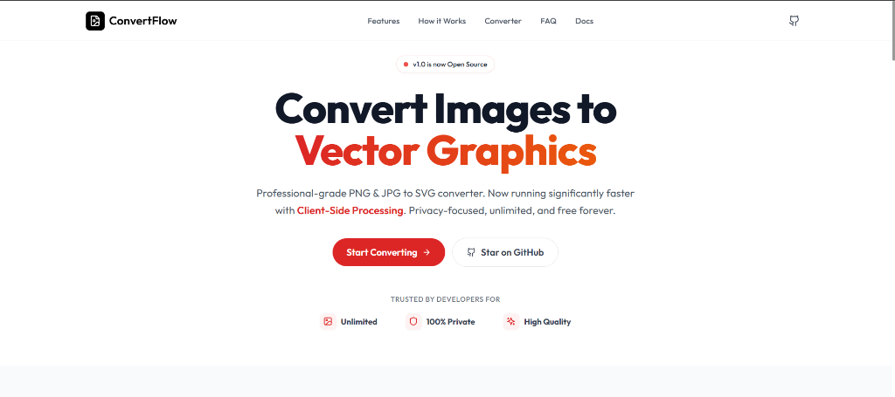

# ConvertFlow



**ConvertFlow** is a professional-grade, open-source image-to-vector converter. It transforms raster images (PNG, JPG, BMP) into scalable vector graphics (SVG) using a powerful dual-engine approach.

Designed for privacy and performance, ConvertFlow offers client-side processing for full-color conversions and a robust server-side engine for high-precision black & white line art.

## 🚀 Features

- **Dual Conversion Engines**:
  - **ImageTracer (Client-side)**: Full-color vectorization running entirely in your browser. 100% private.
  - **Potrace (Server-side)**: Industry-standard algorithm for high-contrast black & white outlines.
- **"Studio" Interface**: A professional, focused workspace for managing your conversion queue.
- **Batch Processing**: Convert multiple images simultaneously.
- **Unlimited & Free**: No paywalls, no file size limits, no watermarks.
- **Modern UI**: Clean, Vercel-inspired aesthetic with a responsive design.
- **Privacy First**: Files processed with ImageTracer never leave your device.

## 🛠️ Tech Stack

- **Frontend**: React 18, TypeScript, Vite
- **Styling**: Tailwind CSS, Framer Motion, Lucide Icons
- **Vectorization**: `imagetracerjs` (Client), `potrace` (Server/Node.js)
- **Backend**: Node.js, Express (for Potrace fallback)

## 📦 Installation

Clone the repository and install dependencies for both client and server.

```bash
# Clone repository
git clone https://github.com/gyancodes/convertflow.git
cd border-radius

# Install Client Dependencies
cd client
npm install

# Install Server Dependencies
cd ../server
npm install
```

## ⚡ Usage

Run the development servers:

```bash
# Start Client and Server concurrently (from root if configured, or separately)

# Terminal 1: Client
cd client
npm run dev

# Terminal 2: Server
cd server
npm run dev
```

Visit `http://localhost:5173` to start converting.

## 🔧 Configuration

### Environment Variables

**Client (`client/.env`)**
```env
VITE_API_URL=http://localhost:3000
```

**Server (`server/.env`)**
```env
PORT=3000
FRONTEND_URL=http://localhost:5173
```

## 🤝 Contributing

Contributions are welcome! Please feel free to submit a Pull Request.

## 📄 License

This project is open source and available under the [MIT License](LICENSE).
